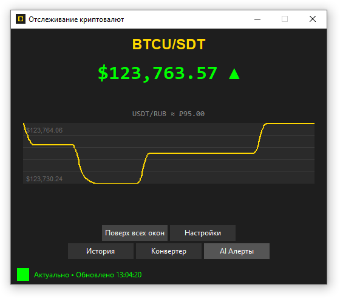

# Crypto Price Tracker

---
Многофункциональное приложение для отслеживания цен криптовалют в реальном
времени с расширенными возможностями анализа и уведомлений.

## 🚀 Основные возможности

### 📊 Отслеживание цен в реальном времени
- Подключение к Binance WebSocket для получения live-данных
- Отображение текущей цены с цветовой индикацией изменений
- Мини-график ценового движения
- Конвертация в RUB, EUR и другие валюты

### 🔔 Умные уведомления
- **Базовые алерты**: изменение цены на заданный процент
- **Абсолютные пороги**: уведомления при достижении конкретных цен
- **Технические индикаторы**: RSI, объемы, уровни поддержки/сопротивления
- **AI предсказания**: машинное обучение для прогнозирования движения цен

### 🛠 Дополнительные инструменты
- **Конвертер валют**: BTC/USDT → RUB
- **История оповещений**: просмотр всех сработавших алертов
- **Системный трей**: работа в фоновом режиме
- **Мультиязычность**: русский и английский интерфейсы

## 📦 Установка

### Требования
- Python 3.8 или выше
- pip (менеджер пакетов Python)

### Установка зависимостей

git clone https://github.com/Hashmaster82/btc_live_price.git

install_requirements.bat


```bash
# Базовые зависимости
pip install websocket-client requests numpy scikit-learn pandas

# Для системных уведомлений
pip install plyer

# Для работы в системном трее (опционально)
pip install pystray pillow

# Для звуковых уведомлений на Windows
# winsound входит в стандартную библиотеку Python

### Запуск приложения
python app.py
```

## ⚙️ Настройка

### Основные настройки
- **Торговая пара**: выбор отслеживаемой пары (BTC/USDT, ETH/USDT и др.)
- **Пороги уведомлений**: относительные (%) и абсолютные значения
- **Язык интерфейса**: русский или английский
- **Внешний вид**: отображение графика, цветовая индикация

### Расширенные настройки алертов

#### Технические индикаторы
- **RSI**: настройка уровней перекупленности/перепроданности
- **Анализ объемов**: уведомления при аномальных объемах торгов
- **Уровни поддержки/сопротивления**: автоматическое определение и алерты

#### AI предсказания
- **Порог предсказания**: минимальное изменение цены для уведомления
- **Уверенность модели**: минимальная достоверность прогноза
- **Автоматическое обучение**: модель переобучается на новых данных

## 🎯 Использование

### Основные горячие клавиши
- `Ctrl+H` - показать/скрыть окно
- `Ctrl+L` - история оповещений
- `Ctrl+A` - расширенные настройки алертов
- `Ctrl+Q` - выход из приложения

### Мониторинг цен
1. Запустите приложение
2. Выберите торговую пару в настройках
3. Настройте пороги уведомлений
4. Приложение будет работать в фоне и уведомлять о значительных движениях

### Конвертер валют
- Доступен через кнопку "Конвертер"
- Поддерживает конвертацию BTC→RUB и USDT→RUB
- Использует актуальные курсы с Binance

## 🔧 Технические детали

### Архитектура
- **WebSocket клиент**: подключение к Binance для реального времени
- **REST fallback**: резервное обновление при проблемах с WebSocket
- **Многопоточность**: отдельные потоки для GUI, WebSocket и анализа
- **Логирование**: подробные логи в файл `crypto_app.log`

### Алгоритмы анализа
- **RSI расчет**: Relative Strength Index за 14 периодов
- **Анализ объемов**: сравнение с скользящим средним
- **ML модель**: линейная регрессия с фичами на основе исторических данных
- **Поддержка/сопротивление**: минимумы/максимумы в окне анализа

## 📁 Структура проекта

```
crypto-tracker/
├── app.py                 # Основной файл приложения
├── config.json           # Файл конфигурации
├── crypto_app.log        # Файл логов
├── locales/              # Файлы локализации
│   ├── ru.json
│   └── en.json
└── README.md
```

## 🐛 Решение проблем

### Проблемы с подключением
- Проверьте интернет-соединение
- Убедитесь, что Binance доступен в вашем регионе
- Проверьте фаервол/антивирус

### Проблемы с зависимостями
```bash
# Переустановка всех зависимостей
pip install --force-reinstall websocket-client requests numpy scikit-learn pandas plyer pystray pillow
```

### Логирование
Подробная информация сохраняется в `crypto_app.log`. Проверьте этот файл при возникновении проблем.


## 📄 Лицензия

Этот проект распространяется под лицензией MIT. Подробнее см. в файле LICENSE.

## ⚠️ Отказ от ответственности

Это приложение предназначено для информационных целей и не является финансовой рекомендацией. Торговля криптовалютами сопряжена с высокими рисками. Авторы не несут ответственности за любые финансовые потери.