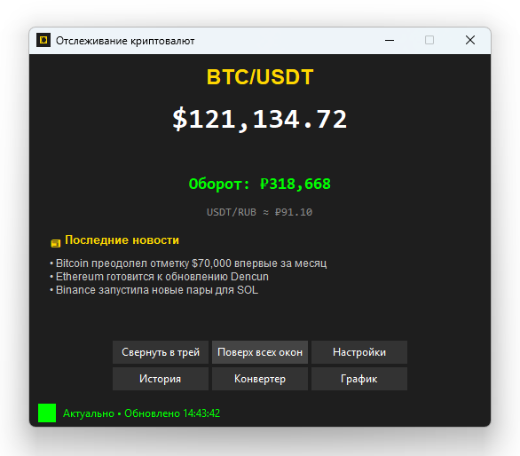
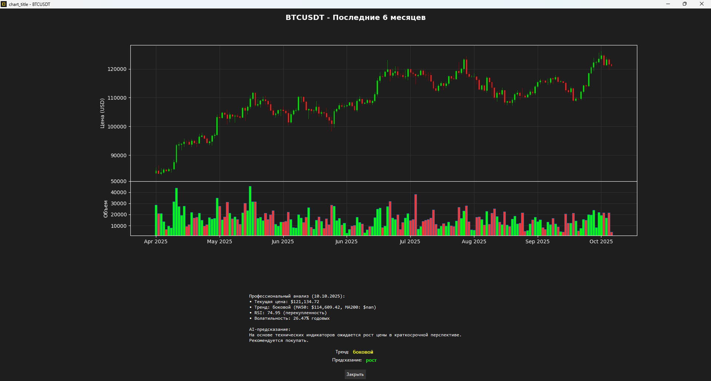

# Crypto Price Tracker 🚀

desktop-приложение для мониторинга цен криптовалют в реальном времени с расширенной аналитикой и системой оповещений.




## ✨ Особенности

### 📊 Мониторинг в реальном времени
- **Live-данные** с Binance через WebSocket
- **Поддержка множества пар**: BTC/USDT, ETH/USDT, SOL/USDT и другие
- **Автоматический фолбэк** на REST API при потере соединения
- **Обновление каждую секунду** с минимальной задержкой

### 🔔 Умная система оповещений
- **Относительные оповещения** (изменение цены на X% за 5 секунд)
- **Абсолютные пороги** (цена ≥ Y или ≤ Z)
- **Гибкие настройки** коголдауна между оповещениями
- **Мультимедийные уведомления**: звук + системные нотификации

### 📈 Профессиональная аналитика
- **Интерактивные графики** свечей за 6 месяцев
- **Технические индикаторы**: RSI, MA50, MA200, волатильность
- **AI-предсказания** трендов на основе технического анализа
- **Детальная аналитика** с цветовыми индикаторами

### 💱 Утилиты и инструменты
- **Конвертер валют** BTC→RUB и USDT→RUB
- **Расчет портфеля** в реальном времени
- **История оповещений** с временными метками
- **Мультиязычный интерфейс** (русский/английский)

### 🎨 Профессиональный UI/UX
- **Темная тема** с акцентными цветами
- **Системный трей** для фоновой работы
- **Горячие клавиши** для быстрого доступа
- **Адаптивный интерфейс** с плавными анимациями

## 🚀 Быстрый старт

### Установка зависимостей

```bash
# Клонирование репозитория
git clone https://github.com/Hashmaster82/btc_live_price.git
cd btc_live_price

# Установка зависимостей
pip install -r requirements.txt
```

### Запуск приложения

```bash
python main.py
```

### Сборка в исполняемый файл (опционально)

```bash
pip install pyinstaller
pyinstaller --onefile --windowed --name "CryptoPriceTracker" main.py
```

## 📦 Требования

### Основные зависимости
```
Python 3.8+
tkinter (входит в стандартную поставку Python)
```

### Рекомендуемые зависимости
```txt
websocket-client==1.6.3      # WebSocket соединения
requests==2.31.0            # HTTP запросы
pystray==0.19.4             # Системный трей
Pillow==10.0.1              # Обработка изображений
plyer==2.1.0                # Системные уведомления
matplotlib==3.7.2           # Построение графиков
mplfinance==0.12.10a0       # Свечные графики
pandas==2.0.3               # Анализ данных
tenacity==8.2.3             # Повторные попытки запросов
```

## 🛠 Архитектура проекта

```
crypto-tracker/
├── main.py                 # Главный модуль приложения
├── config.py              # Управление конфигурацией
├── models.py              # Модели данных и бизнес-логика
├── services.py            # Внешние сервисы и API
├── views.py               # Классы пользовательского интерфейса
├── utils.py               # Вспомогательные утилиты
├── locales/               # Файлы локализации
│   ├── en.json
│   └── ru.json
├── tests/                 # Модульные тесты
│   ├── test_models.py
│   └── test_services.py
└── config.json           # Файл конфигурации (создается автоматически)
```

### Ключевые компоненты

- **`CryptoPriceApp`** - главный класс приложения
- **`PriceMonitor`** - мониторинг цен и система оповещений
- **`BinancePriceProvider`** - поставщик данных с Binance
- **`SettingsWindow`** - управление настройками
- **`ChartWindow`** - продвинутые графики и аналитика

## ⚙️ Конфигурация

### Настройки по умолчанию
```json
{
  "language": "auto",
  "symbol": "btcusdt",
  "portfolio_asset": "BTC",
  "portfolio_amount": 0.0,
  "alert_threshold_up": 1.0,
  "alert_threshold_down": 1.0,
  "alert_cooldown_sec": 15,
  "show_notifications": true,
  "show_sound": true,
  "color_price": true
}
```

### Поддерживаемые торговые пары
- `btcusdt`, `ethusdt`, `solusdt`
- `btceur`, `etheur`, `soleur`
- `btcrub`, `ethrub`, `solrub`

## 🎯 Использование

### Основные функции

1. **Запуск мониторинга**
   - Приложение автоматически подключается к Binance
   - Цены обновляются в реальном времени
   - Статус соединения отображается в нижней панели

2. **Настройка оповещений**
   - Откройте Настройки → Оповещения
   - Установите пороги изменения цены
   - Настройте абсолютные значения для уведомлений

3. **Просмотр графиков**
   - Нажмите "График" для детального анализа
   - Изучите технические индикаторы
   - Используйте AI-предсказания для принятия решений

4. **Работа с портфелем**
   - Укажите количество активов в настройках
   - Следите за общей стоимостью в основной панели
   - Используйте конвертер для быстрых расчетов

### Горячие клавиши

- `Ctrl + Q` - Выход из приложения
- `Ctrl + H` - Показать/скрыть окно
- `Ctrl + L` - История оповещений

## 🔧 Разработка

### Структура кода

Приложение построено по модульной архитектуре с четким разделением ответственности:

- **Модели** - бизнес-логика и данные
- **Сервисы** - взаимодействие с внешними API
- **Представления** - пользовательский интерфейс
- **Утилиты** - вспомогательные функции

### Добавление новой функциональности

1. **Новый поставщик цен**:
```python
class NewPriceProvider(PriceProvider):
    def get_current_price(self, symbol: str) -> Optional[float]:
        # Реализация
        pass
```

2. **Новый тип оповещения**:
```python
class CustomAlert(AlertConfig):
    def check_conditions(self, price_data) -> bool:
        # Логика проверки
        pass
```

### Тестирование

```bash
# Запуск всех тестов
python -m pytest tests/

# Запуск конкретного теста
python -m pytest tests/test_models.py -v
```

## 🌐 API Интеграции

### Binance API
- **WebSocket Streams** для реального времени
- **REST API** для исторических данных и фолбэка
- **Автоматическое восстановление** соединения

### News API (опционально)
- **Крипто-новости** в реальном времени
- **Мультиязычный контент**
- **Кэширование** для снижения нагрузки

## 📊 Мониторинг и логи

Приложение ведет детальное логирование в файл `crypto_app.log`:

- Соединения WebSocket
- Оповещения и уведомления
- Ошибки и исключения
- Производительность системы

## 🐛 Решение проблем

### Частые вопросы

**Q: Приложение не подключается к Binance**
A: Проверьте интернет-соединение и брандмауэр

**Q: Не работают уведомления**
A: Убедитесь, что установлены зависимости для уведомлений

**Q: Графики не отображаются**
A: Установите matplotlib и mplfinance

### Логирование ошибок

Все ошибки записываются в `crypto_app.log`. При возникновении проблем предоставьте этот файл для диагностики.

### Стандарты кода

- Следуйте PEP 8
- Используйте type hints
- Пишите документацию для всех публичных методов
- Добавляйте тесты для новой функциональности

## 📄 Лицензия

Этот проект распространяется под лицензией MIT. Подробнее см. в файле [LICENSE](LICENSE).

## ⚠️ Отказ от ответственности

Это приложение предназначено для информационных целей и не является финансовой рекомендацией. Торговля криптовалютами сопряжена с высокими рисками. Авторы не несут ответственности за любые финансовые потери.

## 👨‍💻 Авторы

- **Григорий Разин** - [GitHub профиль](https://github.com/Hashmaster82)

## 🙏 Благодарности

- Binance за предоставление бесплатного API
- Сообществу Python за отличные библиотеки
- Всем контрибьюторам проекта

---

**⭐ Если этот проект был полезен, поставьте звезду на GitHub!**